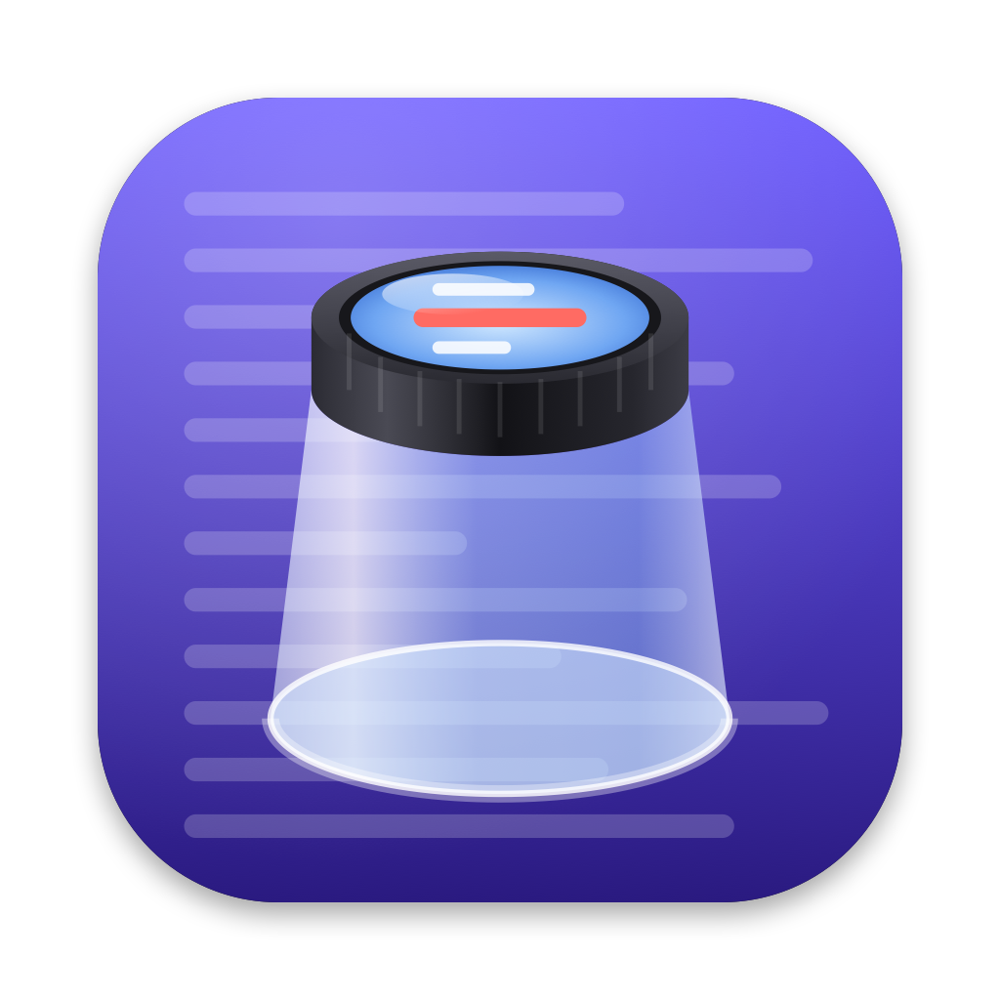
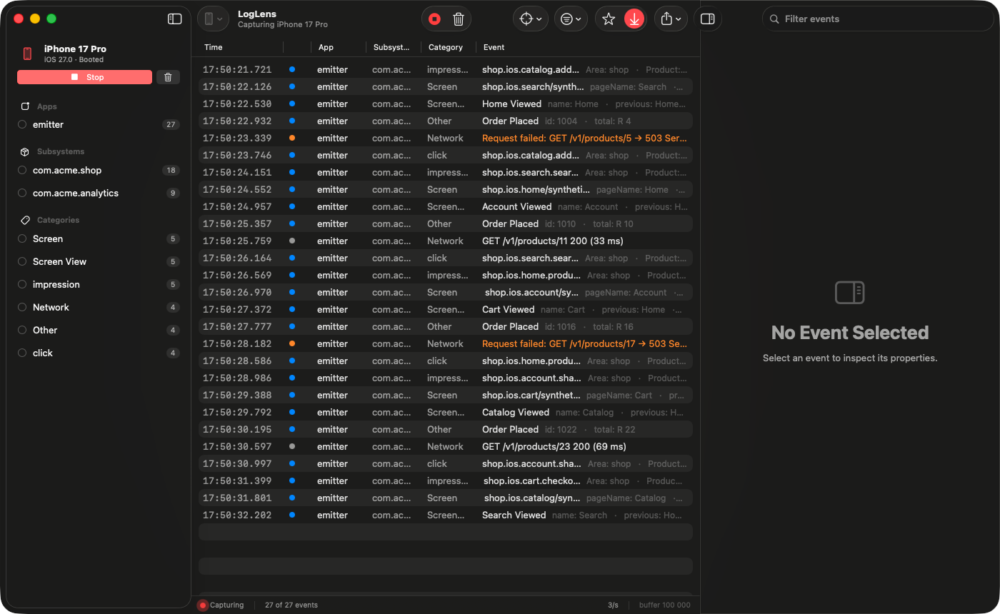

<p align="center">
  
</p>

<h1 align="center">LogLens</h1>

<p align="center">
  A Mac app for watching what your iOS app logs, live.<br>
  <a href="https://github.com/HugoPrinsloo/LogLens/releases/latest">Download</a> &middot;
  <a href="#install">Install</a> &middot;
  <a href="#using-it">Using it</a> &middot;
  <a href="#releasing">Releasing</a>
</p>

Pick a simulator, press Record, and every `os.Logger` message shows up in a table you can filter by app, subsystem, category, level, or plain text. Click a row and the inspector splits the message into its fields.



## Why this exists

Console.app can technically do this. In practice you spend the first ten minutes building a predicate to silence the system noise, the search lags behind the stream, and a multi-line message gets squashed into one row. I wanted something closer to Proxyman, but for log events. Just my app's output, with an inspector that understands the message instead of only showing it.

No SDK, no changes to the iOS app. If it already logs with `os.Logger`, LogLens can see it.

## Install

1. Download the latest `.dmg` from [Releases](https://github.com/HugoPrinsloo/LogLens/releases/latest).
2. Open it and drag LogLens to Applications.

The app is signed with a Developer ID and notarized by Apple, so it opens like any other Mac app. You need macOS 15 or later. To watch simulators you also need Xcode installed, because LogLens finds simulators and streams their logs through `xcrun simctl`. Watching this Mac's own logs works without Xcode.

### Build it yourself

The project file is generated with [xcodegen](https://github.com/yonaskolb/XcodeGen).

```
brew install xcodegen
git clone git@github.com:HugoPrinsloo/LogLens.git
cd LogLens
xcodegen generate
open LogLens.xcodeproj
```

Then hit Run. If you'd rather stay in the terminal:

```
xcodebuild -project LogLens.xcodeproj -scheme LogLens -configuration Debug -derivedDataPath build build
open build/Build/Products/Debug/LogLens.app
```

The generated `LogLens.xcodeproj` is checked in, so you only need to run `xcodegen generate` again after editing `project.yml`.

## Using it

1. Choose a source in the toolbar. Booted simulators are listed first. "This Mac" streams the host's unified log instead.
2. Press Record (or ⌘R) and use your app.
3. Filter. Clicking an app, subsystem, or category in the sidebar shows only that one. ⌘-click adds more. The search box matches against the message, the title, and the names of the process, subsystem, and category.
4. Select a row to inspect it. ⇧⌘S stars a row, and the star toggle in the toolbar shows only starred rows.

Passing `--record` on the command line starts capturing as soon as the app launches. Handy when you're scripting a test run.

### Scope

The Scope menu controls what `log stream` emits at the source, so the noisy stuff never reaches the app in the first place.

| Scope | What it captures |
|---|---|
| App logs only (default) | Apps you installed, minus the `com.apple.*` subsystems |
| Apps, incl. Apple subsystems | Everything those apps log, including networking and UIKit chatter |
| Everything | Every process on the device. Prepare to scroll. |
| Custom predicate | Whatever you'd pass to `log stream --predicate`, for example `subsystem == "com.example.app"` |

The exact command LogLens runs is shown in Settings and on the empty screen, so you can paste it into a terminal if you ever want to double check.

### Shortcuts

⌘R record or stop, ⌘K clear, ⇧⌘T follow newest, ⇧⌘0 reset filters, ⌥⌘I toggle the inspector, ⌘F search.

## Getting the most out of the inspector

Any `os.Logger` call works. LogLens does something extra with messages written as `Key: Value` lines:

```swift
import OSLog

let logger = Logger(subsystem: "com.example.shop", category: "Analytics")

logger.info("""
Event: cart.checkout_button.click
Screen: Cart
Items: \(count, privacy: .public)
""")
```

That shows up as a title of `cart.checkout_button.click` with a Fields table underneath. A line ending in a colon followed by `- key: value` lines becomes a group. Swift struct descriptions like `ScreenInfo(name: "Cart", items: 3)` and dictionary literals like `["source": "editor"]` are also unpacked into key/value rows.

Two things worth knowing about `os.Logger`:

Interpolated values are redacted as `<private>` unless you mark them `privacy: .public`. This applies to LogLens the same as it does to Console.

`.info` and `.debug` messages are not written to disk, they are only visible while something is streaming. LogLens is always streaming, so they're fine. Just don't expect to find them later with `log show`.

## How it works

Simulator processes are ordinary macOS processes, so what they log ends up in the host's unified logging system. LogLens runs

```
xcrun simctl spawn <udid> log stream --style ndjson --level debug --type log --predicate '...'
```

and reads the JSON lines off stdout. Each line becomes a `LogEntry`, gets parsed, and lands in a ring buffer (100,000 entries by default, adjustable in Settings). Filtering is applied incrementally as entries arrive so the table stays responsive at a few thousand events per second.

There is no network code in the app and nothing phones home. The only things it persists are four preferences. Exports are JSON files you save through the normal panel.

## Physical devices

Not yet. Xcode 27's `devicectl` can list a paired iPhone but has no command for streaming its log, so LogLens shows physical devices greyed out. The two realistic routes are `pymobiledevice3` as an optional transport, or a small in-app sink that forwards events over the local network. The capture layer (`LogSource` and `LogStreamer`) is separated from the UI with this in mind. Contributions welcome.

## Releasing

Mostly a note to myself. Signing uses Xcode's cloud-managed Developer ID certificate for my team, so the only one-time setup is storing notarization credentials in the keychain (app-specific password from account.apple.com):

```
xcrun notarytool store-credentials "LogLens-Notary" --apple-id you@example.com --team-id 7VT5H6VPXH
```

Then, from a clean working tree:

```
scripts/release.sh 1.2.0
```

That sets the version in `project.yml`, archives a Release build, exports it with the Developer ID, notarizes and staples the app, wraps it in a `.dmg` (notarized too), commits the bump, and publishes a GitHub release with the dmg, a zip, and their SHA-256s. Add `--no-publish` to stop after building.

## Project layout

```
LogLens/
  App/        LogLensApp: scene, menus, shortcuts
  Capture/    LogSource, SourceDiscovery (simctl, devicectl), LogStreamer (log stream to LogEntry)
  Parsing/    MessageParser, SwiftDescriptionParser
  Models/     LogEntry, LogLevel, ParsedMessage
  Store/      EventStore (@Observable), LogFilter
  Views/      ContentView, Sidebar, Table, Detail, Settings
  Support/    Formatters, ExportDocument, Pasteboard
  Resources/  AppIcon.icon (Liquid Glass layers) and the PNG fallback catalog
scripts/
  make-icon.swift      renders the PNG icon set from the .icon layers
  release.sh           build, sign, notarize, publish (dmg + zip)
```

## License

MIT. See [LICENSE](LICENSE).
